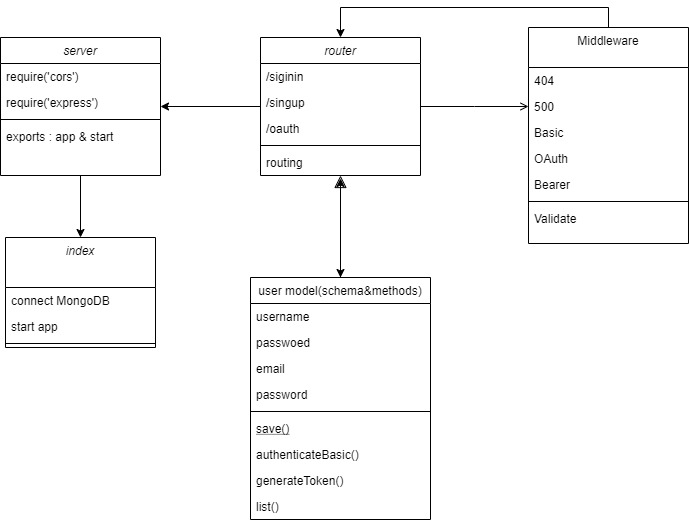

#### Author: NEDAL EREKAT
# auth-server

An Express/Node.js based server using a custom “authentication” module that is designed to handle user registration and sign in using Basic, Bearer, or OAuth along with a custom “authorization” module that will grant/deny users access to the server based on their role or permissions level.

## authentication modules:
1. Basic Auth.
2. Bearer Auth.
3. OAuth.

### .env requirements:
- PORT
- MONGOOSE_url
- CLIENT_id
- CLINET_secret

### Running the app
npm start
- Endpoint: /signin
- Endpoint: /signup
- Endpoint: /users
- Endpoint: /oauth

### Tests
- Unit Tests: npm run test
- Lint Tests: npm run lint

## UML diagram:
